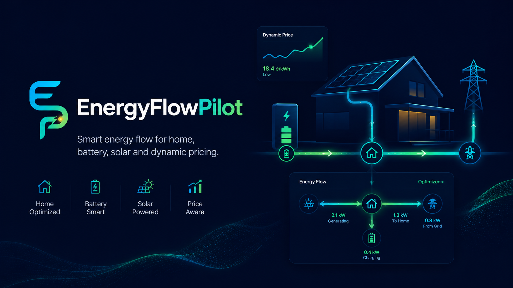

<p align="center">
  
</p>

<p align="center">
  
  
  
  
  
  
  
</p>

<h1 align="center">EnergyFlowPilot</h1>

<p align="center">
  Smart home battery controller that optimizes charging and discharging against Tibber dynamic electricity prices using Victron hardware telemetry.<br/>
  Built for residential use on a Raspberry Pi — fully explainable decisions, live dashboard, forecast simulation and savings tracking.
</p>

---

## Table of Contents

- [Features](#features)
- [How It Works](#how-it-works)
- [Architecture](#architecture)
- [Hardware](#hardware)
- [Dashboard](#dashboard)
- [Getting Started](#getting-started)
- [Deployment](#deployment)
- [Security](#security)

---

## Features

- **Price-aware battery control** — charges during cheap Tibber slots, discharges during expensive ones
- **Explainable decisions** — every action is logged with a structured rule ID and human-readable reason
- **15-minute forecast simulation** — state-of-charge projection over 24 hours, aligned with the live decision rules
- **Live Victron telemetry** — real-time grid, battery and PV data via MQTT (Cerbo GX)
- **Grid export protection** — never discharges more than the current measured import
- **Savings accounting** — daily, weekly, monthly and yearly savings tracked against a baseline
- **Configurable limits** — battery capacity, charge/discharge thresholds, minimum SoC reserve, planning profile
- **Multi-theme Vue dashboard** — light and dark themes, live energy flow visualization
- **Secure settings model** — sensitive values (API tokens, credentials) stored encrypted, never returned to the frontend
- **Raspberry Pi ready** — systemd service, deployment scripts, optional nginx reverse proxy

---

## How It Works

EnergyFlowPilot runs a decision loop on a configurable interval. Each cycle it:

1. Reads live battery state and site telemetry from Victron via MQTT
2. Fetches the current Tibber price forecast (cached, quarter-hourly resolution)
3. Evaluates the price rule against configurable cheap/expensive thresholds
4. Issues a `Charge`, `Discharge` or `Idle` command — with a structured reason
5. Logs the full decision for the history view and savings accounting

The same rule set drives the 24-hour forecast chart, so what the dashboard predicts matches what the engine actually does.

```
Cheap slot  →  Charge from grid
Expensive slot + battery has energy  →  Discharge to cover house load
No clear signal / stale data  →  Idle (safe default)
```

---

## Architecture

```
┌────────────────────────────────────────────────────┐
│                    Frontend (Vue 3)                │
│         Dashboard · Forecast · Settings            │
└──────────────────────┬─────────────────────────────┘
                       │ REST + SignalR
┌──────────────────────▼─────────────────────────────┐
│                    Api (ASP.NET Core)              │
│   Endpoints · Background Services · DI Composition │
└──────┬───────────────────────────────┬─────────────┘
       │                               │
┌──────▼──────┐                ┌───────▼──────┐
│  Business   │◄───interfaces──│     Dal      │
│  Decision   │                │  Tibber API  │
│  Engine     │                │  MQTT/Victron│
│  Forecast   │                │  EF/SQLite   │
│  Savings    │                └──────────────┘
└─────────────┘
```

| Layer | Responsibility |
|---|---|
| `Api` | ASP.NET Core host, HTTP endpoints, SignalR hub, background workers |
| `Business` | Framework-independent domain logic, decision rules, all interfaces |
| `Dal` | EF Core/SQLite repositories, Tibber GraphQL client, Victron MQTT adapter |
| `Frontend` | Vue 3 + Vuetify 4 dashboard, API-backed, no business logic |

Business logic is fully isolated behind interfaces — local development and tests work without real Tibber credentials or Victron hardware.

---

## Hardware

Designed around a Victron/Pylontech residential installation:

| Component | Model |
|---|---|
| Battery modules | 4× Pylontech US5000 LiFePO4 48 V |
| Total storage | 19.2 kWh |
| Inverter/charger | Victron MultiPlus-II 48/5000/70-50 |
| System monitor | Victron Cerbo GX MK2 |
| Energy meter | Victron ET340 three-phase, max. 65 A/phase |
| BMS cable | VE.Can to CAN-bus BMS Type B, 1.8 m |

Telemetry is read from the Cerbo GX over MQTT. No direct hardware access or Victron API keys are required — only local network MQTT access to the Cerbo GX.

> A planned E3/DC integration will add reliable live PV production values in a later stage.

---

## Dashboard

The Vue dashboard provides:

- **Live status bar** — controller state, MQTT connection, Tibber price, last telemetry timestamp (updates live via SignalR)
- **Current decision panel** — active state (Charge / Discharge / Idle), reason, Tibber price, battery SoC
- **Forecast chart** — 24-hour price forecast colored by planned decision, with expected SoC curve
- **Decision history** — aggregated time series with filtering by time range
- **Live energy flow** — animated grid / battery / PV / house schematic (light and dark scene)
- **Savings overview** — daily, weekly, monthly and yearly savings breakdown
- **Settings page** — all controller parameters configurable from the UI

Multiple themes are available including a dark mission dashboard, a control-center layout and a mobile-focused dark theme.

<p align="center">
  
</p>

---

## Getting Started

### Requirements

- [.NET 10 SDK](https://dotnet.microsoft.com/download)
- Node.js 20+ and npm
- A Tibber account with API access
- A Victron system with Cerbo GX reachable on the local network via MQTT

### Backend

```powershell
dotnet build
dotnet run --project src/TibberVictronController.Api
```

The API starts on `http://localhost:5000`. On first run it creates a local SQLite database and seeds default settings. Configure Tibber token, MQTT host and battery parameters through the Settings page.

### Frontend (dev server)

```powershell
cd src/TibberVictronController.Frontend
npm install
npm run dev        # Vite dev server on :5173, proxies /api to backend
```

### Tests

```powershell
dotnet test
dotnet test tests/TibberVictronController.Business.Tests   # single project
```

---

## Deployment

The intended production setup is a Raspberry Pi running the backend as a systemd service with the frontend served as static files from the ASP.NET Core host.

```powershell
# Build frontend assets into the API publish output
cd src/TibberVictronController.Frontend
npm run build

# Publish backend
dotnet publish src/TibberVictronController.Api -c Release -o publish/
```

Helper scripts for Raspberry Pi setup, service installation and auto-update are in [`scripts/deploy/`](scripts/deploy/).

---

## Security

- Runtime secrets (Tibber token, MQTT password) are stored in SQLite via the settings model — not in `appsettings.json`
- Sensitive values are never returned to the frontend in plain text
- The SQLite database file should be protected by OS-level file permissions on the Pi
- `appsettings.*.local.json` and `*.db` files are excluded from version control via `.gitignore`
- Do not commit real tokens or credentials to this repository

---

## Topics

`tibber` · `victron` · `pylontech` · `cerbo-gx` · `multiplus-ii` · `home-energy-management` · `battery-storage` · `dynamic-electricity-prices` · `mqtt` · `aspnetcore` · `dotnet` · `vue` · `sqlite` · `raspberry-pi` · `energy-automation` · `solar-battery`
